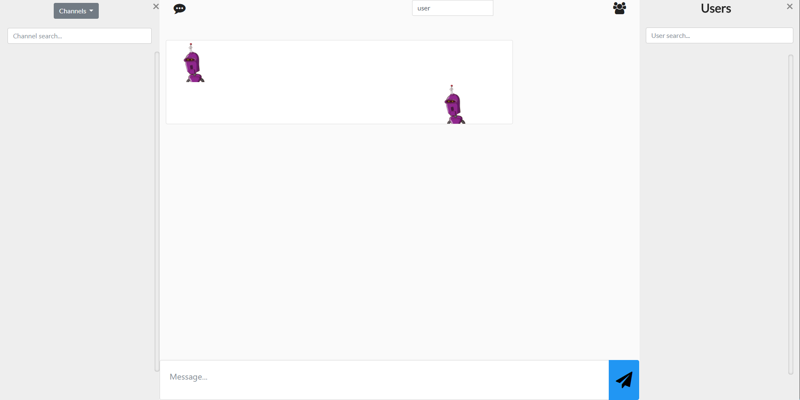

# Chat Team H

A cool chat made with Angular2 (Polytech'Nice SI3 2016-2017)

## Features

* MVP:
  * Send message in the general channel
  * Switch channel
  * Create a channel
  * Show history of a channel

* Extensions:
  * Embedded images
  * ```/meteo```, ```/ia```, ```/trad```, ```/schedule``` commands
  * Emotes
  * Mute a user
  * Private messages
  * Login and switch user
  * Responsive Design
  * Youtube, Instagram, Twitter integration

## Screenshot



## Uses

* Node.js
* Angular2

## How to use

```bash
npm install   % Install Node.js dependencies
npm start     % Starts the client chat (localhost:4200 by default)
```

## Notes

The chat depends on an custom-made API: ```http://projet-3a.7ight.com/api/``` which doesn't exist anymore.